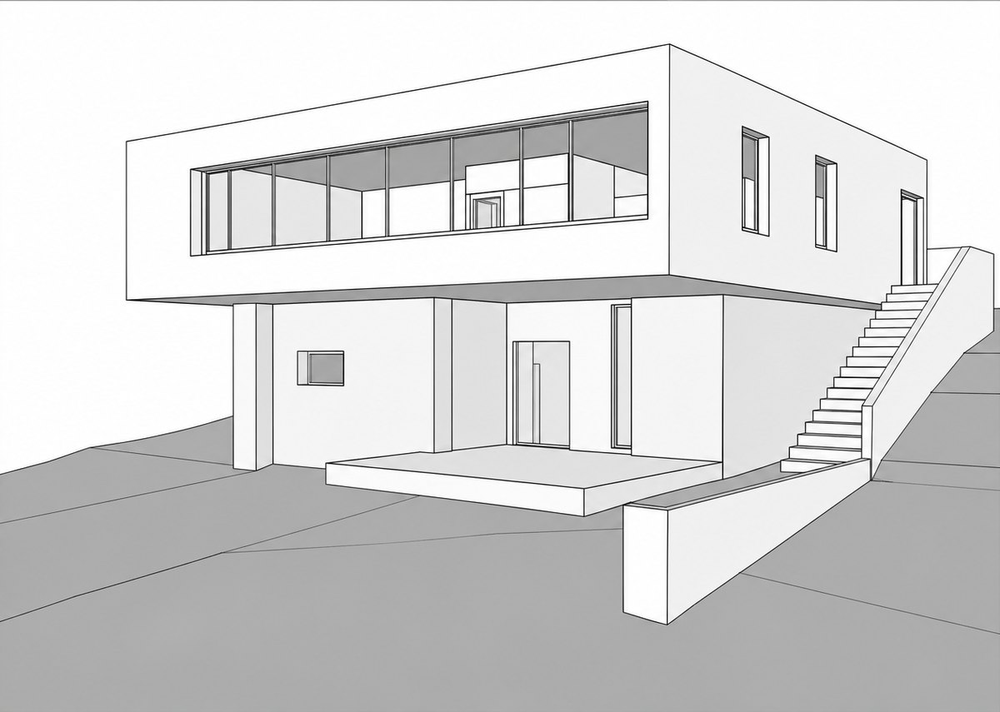
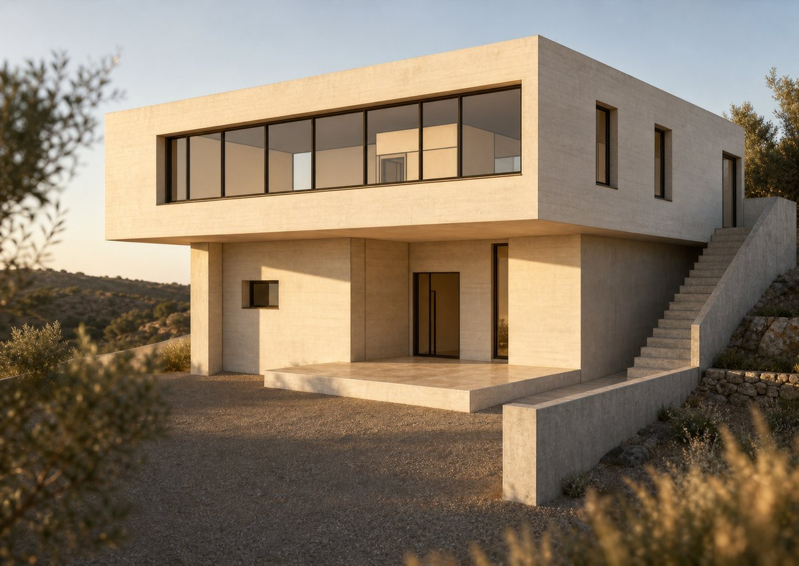
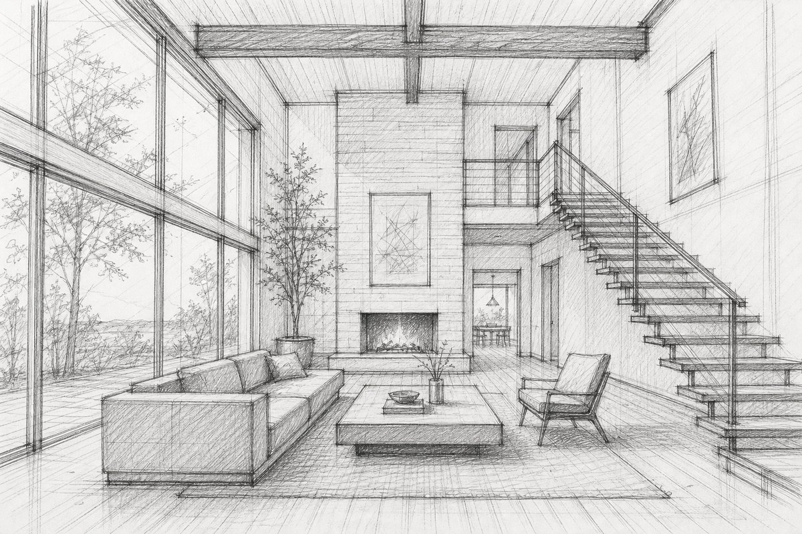
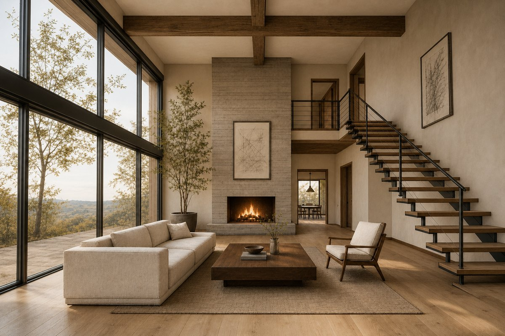

# arch-render — ARCHI Rendering Studio

An agent skill that turns any architectural input — a floor plan, sketch, elevation, section, or a
SketchUp / Revit / Rhino / D5 / Lumion / Enscape screenshot — into a premium visualization, or into a
paste-ready prompt for Midjourney, DALL·E, Stable Diffusion or V-Ray.

It enhances the project; it never redesigns it. Existing geometry, camera and layout are preserved
unless you explicitly ask for a redesign.

## Before → after

An untextured massing model in, a photoreal render out. Same camera, same cantilever, same ribbon
window, same three punched windows, same external stair — materials, light and context added.

| Input | Output |
|---|---|
|  |  |

A pencil concept sketch in, a photoreal interior out. Every element holds position: the glazed wall,
the open-tread stair, the sofa and coffee table, the armchair, the beams, the fireplace, the potted
tree, the mezzanine, the dining room beyond.

| Input | Output |
|---|---|
|  |  |

That is the **Preservation Contract**: the skill adds materials, light and context, and leaves the
architecture alone.

<sub>Both pairs were produced by this skill's `scripts/render.py`. The two inputs are synthetic — they
were generated rather than drawn by hand — so they are cleaner than a real napkin sketch. The
before → after transformation itself is genuine and reproducible.</sub>

## Install

```bash
npx skills add dakhlallah/arch-render
```

## What it does

- **Render** — photoreal exteriors and interiors, golden hour / night variants, plan → 3D or dollhouse,
  facades, sections, masterplans, isometric cutaways, moodboards and presentation boards.
- **Transform** — polish a flat render, upscale / sharpen, kill the CGI look, match the *look* of a
  style reference (never its architecture), produce a visually consistent render set.
- **Advise** — design review and critique, typology briefs (healthcare, hospitality, civic, industrial,
  landscape, transport, workplace/retail, residential), area analysis, FF&E and space planning,
  lighting design, code and accessibility checks, structural/MEP/BIM coordination, specs, cost,
  buildability and sustainability. Coordination-level advice, never engineering sign-off.

Works in English, French and Arabic.

Not for logos, code, or video.

## Setup

No API key ships with this skill.

- `scripts/render.py` and `scripts/board.py` read `OPENAI_API_KEY` from the environment:
  ```bash
  export OPENAI_API_KEY=sk-...
  ```
- The upscale / relight paths (`§88`, `§89`) call the **Magnific** MCP server. Those routes are
  optional — everything else works without it.

## Layout

```
SKILL.md                 entry point and routing table
references/              prompt recipes, styles, render types, material catalog,
                         production modes, advisory and technical references
references/typologies/   per-building-type briefs
scripts/                 render.py, board.py
evals/                   EVALS.md
```

## License

MIT
