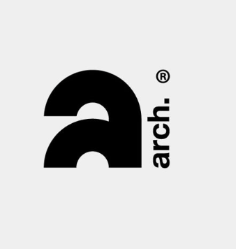

<p align="center">
  
</p>

<h1 align="center">ARCHI Rendering Studio Ultimate</h1>

<p align="center">
  Preservation-first architectural intelligence for Codex.<br>
  Turn plans, sketches, drawings, BIM/CAD exports, and existing renders into professional visualizations, documentation, reviews, and presentations—without silently redesigning the project.
</p>

<p align="center">
  
  
  
  
</p>

<p align="center">
  <a href="#installation">
    
  </a>
</p>

<p align="center">
  <a href="#installation">Installation</a> ·
  <a href="#quick-start">Quick start</a> ·
  <a href="#what-you-can-do">Capabilities</a> ·
  <a href="#example-requests">Examples</a> ·
  <a href="#troubleshooting">Troubleshooting</a>
</p>

---

## Why ARCHI Render

Architectural AI often produces attractive images by changing the underlying design. ARCHI Render is built around a different rule: **protect the architecture first, improve the visualization second**.

It can help architects, interior designers, visualization artists, students, consultants, and presentation teams:

- create preservation-first render prompts and visualizations;
- reconstruct evidence-supported 3D views from plans and drawings;
- improve materials, lighting, realism, atmosphere, and post-production;
- coordinate room-by-room interiors, FF&E, cameras, and visual storytelling;
- review projects across architecture, BIM, constructability, sustainability, cost, and presentation;
- prepare portfolios, boards, schedules, specifications, and client-facing documentation;
- route approved work through local tools or an authenticated Magnific MCP connection.

> [!IMPORTANT]
> Floor plans, geometry, room locations, circulation, structure, façades, floor count, and other approved design decisions remain locked unless the user explicitly authorizes a named change.

## Visual examples

### Exterior visualization

Same camera, cantilever, ribbon window, punched windows, and external stair. Only materials, lighting, realism, and context were improved.

| Source | Preservation-first result |
|---|---|
|  |  |

### Interior visualization

The glazed wall, stair, furniture positions, beams, fireplace, tree, mezzanine, and room relationships remain aligned with the source.

| Source | Preservation-first result |
|---|---|
|  |  |

<sub>These demonstration inputs are synthetic. The before-and-after workflow is genuine and reproducible with the included rendering script.</sub>

## Installation

> [!NOTE]
> Codex requires users to confirm a third-party Git marketplace before installing from it. A public website cannot silently bypass that security confirmation. The button above opens these verified installation steps.

### Fastest supported install

Copy both lines with GitHub's copy button, paste them into a terminal, and approve the marketplace if Codex asks:

```bash
codex plugin marketplace add https://github.com/dakhlallah/arch-render.git --ref main
codex plugin add arch-render@arch-render-marketplace
```

Then start a new Codex task so the plugin's skill and MCP tools load into a fresh context.

### Option 1 — Codex app

Open **Add plugin marketplace** and enter:

| Field | Value |
|---|---|
| Source | `https://github.com/dakhlallah/arch-render.git` |
| Git ref | `main` |
| Sparse paths | Leave blank |

Add the marketplace, then install **arch-render** from **ARCHI Rendering Studio**.

### Option 2 — Standalone skill

If you only need the agent skill without the complete plugin bundle:

```bash
npx skills add dakhlallah/arch-render
```

## Requirements

- Codex with plugin marketplace support
- Git for marketplace installation
- Node.js 20 or newer for the bundled local MCP server
- An `OPENAI_API_KEY` only when using the optional local rendering scripts
- A Magnific account only when using Magnific generation or upscaling tools

No API key, token, or private credential is included in this repository.

## Quick start

### 1. Start a new task

Open a new Codex task with `arch-render` enabled.

### 2. Upload project evidence

Upload the clearest available source material: plans, elevations, sections, sketches, screenshots, photographs, existing renders, or exported BIM/CAD sheets.

### 3. State the deliverable and locks

Tell ARCHI Render what you want and which decisions must remain unchanged. If you do not request a redesign, preservation mode applies automatically.

```text
Analyze this floor plan and create a room-by-room interior visualization prompt library.
Lock every wall, door, window, room position, dimension, and circulation path.
Mark unreadable or missing information as unknown instead of guessing.
```

### 4. Review before external execution

ARCHI Render separates observed facts, inferences, unknowns, recommendations, and decisions requiring approval. External uploads, paid attempts, and multi-image generation require the applicable capability, privacy, and authorization checks.

## What you can do

| Workflow | Typical deliverables |
|---|---|
| Architectural visualization | Exterior and interior render prompts, direct renders, day/night studies, isometrics, sectional perspectives |
| Image enhancement | Relighting, materials, textures, realism, shadows, reflections, entourage, atmosphere, color grading |
| Plan-to-3D preparation | Source-coverage audit, preservation brief, room inventory, reconstruction prompt set, evidence-supported view plan |
| Materials and FF&E | Material identification, approximate color references, alternatives by cost tier, furniture schedules, PBR texture prompts |
| Camera direction | Lens, height, composition, perspective, hero shots, human-eye views, detail and material sequences |
| Design review | Architecture, interiors, landscape, façade, functionality, constructability, BIM, cost, sustainability, and risk observations |
| Technical coordination | Conceptual MEP routes, lighting logic, maintenance access, clash screening, schedules, draft specifications, approximate quantities |
| Presentation and portfolio | Boards, project narratives, portfolio storyboards, competition booklets, material stories, captions, editorial layouts |
| Project orchestration | Project context, milestones, decisions, capability discovery, prompt packs, environment routing, traceable handoffs |

## Example requests

### Improve an existing render

```text
Improve this exterior render to top-tier studio quality. Preserve the exact geometry,
camera, façade openings, structure, and landscape layout. Improve only materials,
lighting, reflections, atmosphere, entourage, and post-production.
```

### Convert a floor plan into a controlled 3D brief

```text
Prepare a photorealistic 3D reconstruction workflow for this plan. Preserve every
documented measurement and room location. First list verified dimensions, unreadable
dimensions, missing elevations, and any information required before accurate generation.
```

### Build a material specification

```text
Identify the visible materials in this reference. Separate observed facts from approximate
matches. Provide finish, texture, color values, compatible alternatives, cost tiers,
sustainable options, and copy-ready PBR texture prompts without changing the architecture.
```

### Create a coordinated interior package

```text
Create a coherent room-by-room interior package from this plan: space inventory, camera
briefs, material palette, furniture schedule, layered lighting, styling kit, and one
preservation-first image prompt per room. Keep one design language across the project.
```

### Review a project

```text
Review this project at design-development level. Label each item as Observed, Inferred,
Unknown, Recommendation, or Requires professional verification. Focus on circulation,
constructability, coordination risks, material durability, and presentation gaps.
```

### Plan a portfolio

```text
Build a client-ready architectural portfolio storyboard using only the supplied project
evidence. Select relevant sections, define the page grid and visual hierarchy, recommend
drawings and renders, draft captions, and list every missing asset without inventing it.
```

## Preservation contract

### Locked by default

- geometry, dimensions, proportions, and footprint;
- walls, columns, openings, doors, and windows;
- room positions, circulation, floor count, plans, sections, and elevations;
- structure, façade composition, camera framing, and approved Design DNA.

### Safe proposal areas

- material and finish alternatives;
- color palettes and texture quality;
- lighting, shadows, reflections, and atmosphere;
- furniture, styling, landscape, and entourage as separate reversible proposals;
- camera alternatives only when the source camera is not locked;
- rendering quality, upscaling, and post-production.

When evidence is incomplete, the plugin reports what is unknown and requests targeted clarification. It does not silently invent architectural information.

## Supported inputs

| Input | Support |
|---|---|
| PNG, JPG, WEBP, screenshots, and renders | Visual analysis, enhancement, reference extraction, and prompt generation |
| Floor plans, elevations, sections, and details | Drawing interpretation and preservation-first reconstruction preparation |
| PDF or exported BIM/CAD sheets | Evidence review when pages are visible and legible |
| SketchUp, Revit, Rhino, D5, Lumion, Enscape, Blender, and V-Ray screenshots | Rendering, critique, material, camera, and presentation workflows |
| Native `.dwg`, `.rvt`, `.skp`, or `.3dm` files | Requires a compatible parser; otherwise export a PNG, JPG, or PDF view |
| Style and mood references | Mood, material quality, lighting, and visual language only—never source geometry |

All operational responses, prompts, workflows, and deliverables are produced in English.

## Local and external execution

### Bundled Arch Render MCP

The local `arch-render` MCP server provides deterministic, read-only tools for knowledge search, preservation briefs, bounded prompt packs, and preservation decisions. It does not make paid provider calls.

### Magnific MCP

Magnific is an optional authenticated integration for supported generation and upscaling workflows. Complete the OAuth sign-in when prompted. The plugin verifies tool availability and requests approval for a bounded execution plan before external or paid work.

### Local scripts

The standalone scripts use `OPENAI_API_KEY` only when invoked:

```bash
export OPENAI_API_KEY="your-key"
python3 scripts/render.py --image "/path/to/reference.png" --prompt "Your prompt" --aspect auto
```

Create a presentation-board specification and render it locally:

```bash
python3 scripts/board.py --example
python3 scripts/board.py --spec "/path/to/board.json" --out "/path/to/board.html"
```

Never commit `.env` files or credentials.

## Updating

Refresh the public marketplace and reinstall the latest published version:

```bash
codex plugin marketplace upgrade arch-render-marketplace
codex plugin add arch-render@arch-render-marketplace
```

Start a new Codex task after upgrading.

## Troubleshooting

### “Marketplace root does not contain a supported manifest”

Use the repository URL with Git ref `main` and leave **Sparse paths** blank. The supported marketplace manifest is located at `.agents/plugins/marketplace.json`.

### OAuth reports a duplicated parameter

Upgrade the marketplace and reinstall the plugin using the commands above. Release `v1.1-rc.1` removes the redundant OAuth resource override and relies on Magnific discovery metadata.

### The plugin or MCP tools do not appear

Confirm that `arch-render@arch-render-marketplace` is installed and enabled, then start a new Codex task. Plugin tools are loaded when a task begins.

```bash
codex plugin list
codex mcp list
```

### The local MCP server does not start

Confirm Node.js 20 or newer is active:

```bash
node --version
```

### A native BIM/CAD file cannot be read

Export the required view or sheet to a legible PNG, JPG, or PDF. ARCHI Render will report missing views or dimensions rather than fabricate them.

## Professional boundaries

ARCHI Render supports visualization, architectural review, design-development advice, conceptual coordination, and presentation. It does not provide:

- stamped architecture or engineering documents;
- certified code, accessibility, fire, structural, MEP, or energy compliance;
- verified construction pricing without project-specific source data;
- direct native BIM/CAD authoring unless a compatible tool is explicitly available;
- legal advice or architectural video production.

Professional review remains required for regulated, safety-critical, procurement, and construction decisions.

## Repository structure

```text
.agents/plugins/marketplace.json       Public Codex marketplace manifest
plugins/arch-render/                   Complete Codex plugin bundle
plugins/arch-render/.codex-plugin/     Plugin manifest
plugins/arch-render/.mcp.json          Local and optional MCP configuration
plugins/arch-render/skills/            Packaged architectural skill
plugins/arch-render/mcp-server/        Bundled read-only MCP server
SKILL.md                               Standalone skill entry point
references/                            Workflow and domain modules
references/typologies/                 Building-type guidance
scripts/                               Rendering and board utilities
evals/                                 Production and safety evaluation cases
agents/                                Standalone skill UI metadata
```

## Development

Run the bundled MCP contract tests:

```bash
cd plugins/arch-render/mcp-server
npm ci
npm test
```

For bugs or feature requests, open a [GitHub issue](https://github.com/dakhlallah/arch-render/issues) with the input type, expected result, actual result, and reproduction steps. Do not attach confidential client material to public issues.

## License

Released under the [MIT License](LICENSE).
