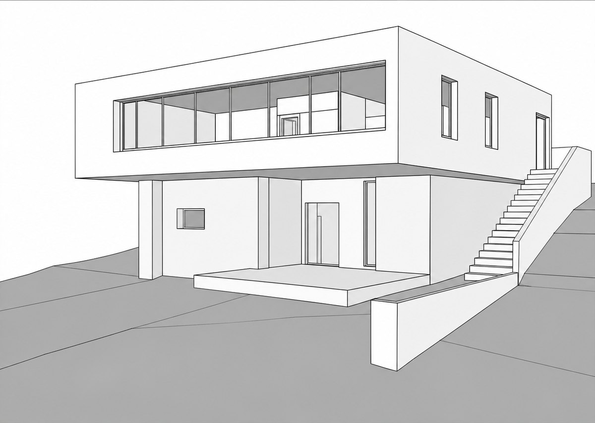
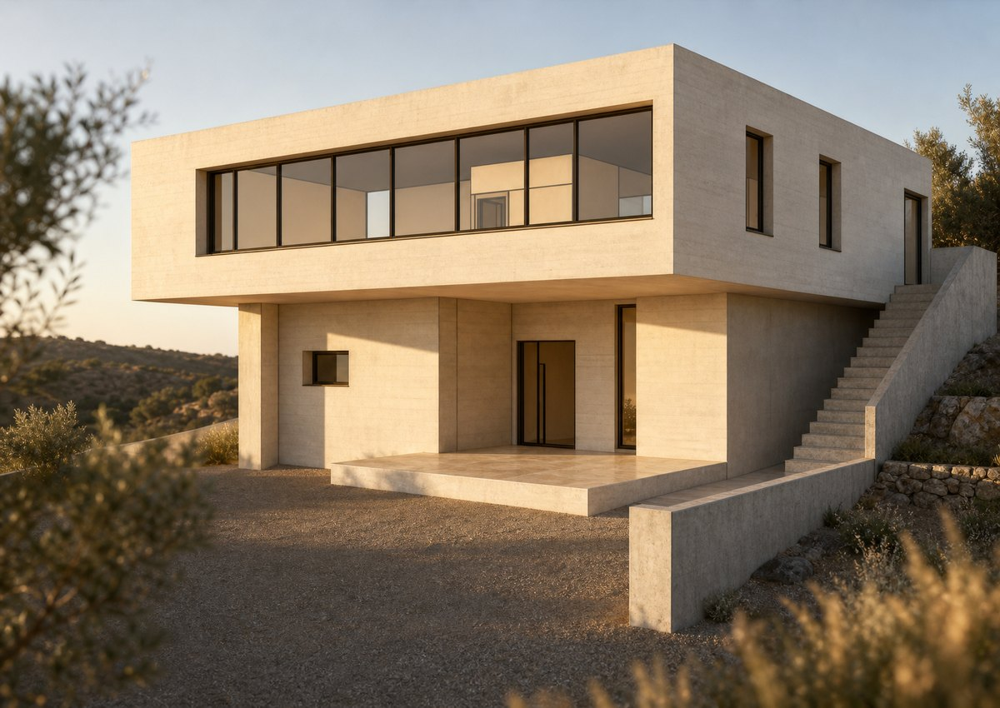
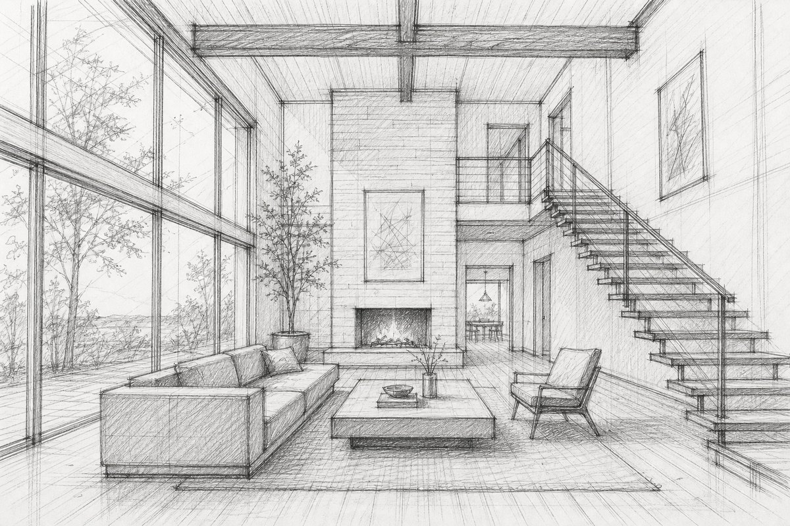

# arch-render — ARCHI Rendering Studio Ultimate

An English-language Codex plugin and standalone agent skill for preservation-first architectural
analysis, visualization, documentation, portfolio production, presentation, and coordination support.
It accepts floor plans, sketches, elevations, sections, renders, photographs, BIM/CAD exports, and
screenshots from SketchUp, Revit, Rhino, D5, Lumion, Enscape, Blender, V-Ray, or similar tools.

It enhances the project; it never redesigns it. Existing geometry, camera and layout are preserved
unless you explicitly ask for a redesign.

## Before → after

An untextured massing model in, a photoreal render out. Same camera, same cantilever, same ribbon
window, same three punched windows, same external stair — materials, light and context added.

| Input | Output |
|---|---|
|  |  |

A pencil concept sketch in, a photoreal interior out. Every element holds position: the glazed wall,
the open-tread stair, the sofa and coffee table, the armchair, the beams, the fireplace, the potted
tree, the mezzanine, the dining room beyond.

| Input | Output |
|---|---|
|  |  |

That is the **Preservation Contract**: the skill adds materials, light and context, and leaves the
architecture alone.

<sub>Both pairs were produced by this skill's `scripts/render.py`. The two inputs are synthetic — they
were generated rather than drawn by hand — so they are cleaner than a real napkin sketch. The
before → after transformation itself is genuine and reproducible.</sub>

## Install the standalone skill

```bash
npx skills add dakhlallah/arch-render
```

The complete Codex plugin bundle is also included in this repository. Its manifest is located at
`.codex-plugin/plugin.json`, the skill at `skills/arch-render/`, and the bundled local MCP server at
`mcp-server/`. The top-level `SKILL.md`, `references/`, `scripts/`, and `evals/` remain synchronized for
backward compatibility with standalone skill installers.

## What it does

- **Render** — photoreal exteriors and interiors, golden hour / night variants, plan → 3D or dollhouse,
  facades, sections, masterplans, isometric cutaways, moodboards and presentation boards.
- **Transform** — polish a flat render, upscale / sharpen, kill the CGI look, match the *look* of a
  style reference (never its architecture), produce a visually consistent render set.
- **Advise** — design review and critique, typology briefs (healthcare, hospitality, civic, industrial,
  landscape, transport, workplace/retail, residential), area analysis, FF&E and space planning,
  lighting design, code and accessibility checks, structural/MEP/BIM coordination, specs, cost,
  buildability and sustainability. Coordination-level advice, never engineering sign-off.
- **Publish** — curate evidence-supported architectural portfolios, competition booklets, project
  monographs, presentation boards, material stories, room-by-room prompt libraries, and client-ready
  editorial packages without fabricating missing drawings or project facts.
- **Orchestrate** — maintain project context, preservation locks, traceability, environment routing,
  prompt packs, optional Magnific workflows, and deterministic local knowledge tools.

All user-facing instructions, prompts, workflows, and deliverables are produced in English.

Not for logos, code, or video.

## Setup

No API key ships with this skill.

- `scripts/render.py` and `scripts/board.py` read `OPENAI_API_KEY` from the environment when their
  corresponding workflows are used:
  ```bash
  export OPENAI_API_KEY=sk-...
  ```
- Magnific is an optional MCP integration. The skill verifies availability, authentication, privacy,
  cost, and attempt authorization before external execution.
- The bundled `arch-render` MCP server performs local, read-only knowledge search, preservation briefs,
  bounded prompt packs, and preservation-check decisions. It makes no paid provider calls.

## Layout

```
.codex-plugin/           Codex plugin manifest
.mcp.json                local and optional MCP configuration
skills/arch-render/      canonical packaged skill
mcp-server/              bundled read-only Arch Render MCP server
SKILL.md                 synchronized standalone entry point
references/              synchronized workflow and domain modules
references/typologies/   per-building-type briefs
scripts/                 rendering and deterministic board utilities
evals/                   production and safety evaluation cases
agents/                  skill UI metadata
```

## License

MIT
